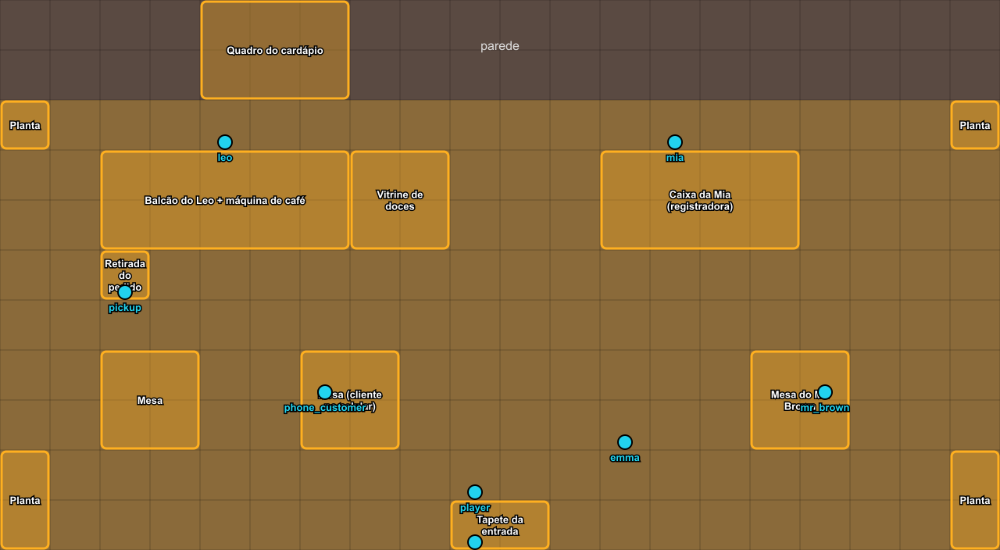

# Mapa da cafeteria (Tiled)

Arquivo: [`public/game/maps/cafe.tmj`](../../public/game/maps/cafe.tmj) — abra direto no Tiled e salve com Ctrl+S. O Phaser lê esse mesmo arquivo, não precisa exportar.

- Tamanho: **20×11 tiles de 32px** (640×352 — a tela inteira do jogo)
- Os tilesets apontam para `public/game-assets/tilesets/` (fora do Git, cópia dos PNGs da LimeZu)

## Camadas

| Camada | Tipo | Para que serve |
|---|---|---|
| `Floor` | tiles | Piso (já preenchido com madeira) |
| `Walls` | tiles | Parede do fundo (já preenchida, creme) |
| `Furniture` | tiles | Balcões, mesas, cadeiras, vitrine, plantas |
| `Decor` | tiles | O que fica **em cima** dos móveis: máquina de café, xícaras, doces, registradora |
| `Above` | tiles | O que deve aparecer **na frente** do jogador (ex.: encosto de cadeira, topo de planta alta) |
| `Collision` | objetos | Retângulos onde o jogador não passa (oculta por padrão — ligue o 👁 para ver) |
| `Points` | objetos | Posições dos personagens e pontos especiais — **não renomeie** |
| `Interact` | objetos | De onde o jogador conversa com cada NPC: os **pés** do jogador precisam estar dentro do retângulo. O nome do retângulo é o do NPC (oculta por padrão) |
| `_Esboco` | objetos | Guia laranja do layout. Só para o editor; o jogo ignora. Esconda quando terminar |

## Pontos (`Points`)

| Nome | O que é |
|---|---|
| `player` | Onde o jogador começa (logo após entrar) |
| `emma` | Recepcionista, perto da entrada |
| `leo` | Barista, atrás do balcão |
| `mia` | Caixa, atrás da registradora |
| `mr_brown` | Cliente sentado (conversa opcional) |
| `phone_customer` | Figurante mexendo no celular |
| `pickup` | Onde o jogador retira o pedido (cena 5) |
| `exit` | Saída (despedida da cena 6) |

O ponto marca **onde ficam os pés** do personagem. Pode arrastar à vontade para ajustar o layout.

## Tilesets disponíveis

| Tileset | Use para |
|---|---|
| `floors` / `walls` | Trocar piso ou parede |
| `kitchen` | Máquina de café, xícaras, vitrine de donuts, doces, pães, mesas, cadeiras, balcões |
| `icecream` | Quadros de cardápio, banquetas, balcão |
| `grocery` | Caixa registradora, balcão de caixa, plantas, vasos |
| `generic` | Plantas, decoração, móveis em geral |
| `livingroom` | Sofás, tapetes, poltronas |

## Passo a passo

1. Instale o Tiled ([mapeditor.org](https://www.mapeditor.org)) e abra `public/game/maps/cafe.tmj`.
2. Selecione a camada `Furniture`, escolha o tileset na aba **Tilesets** (canto inferior direito) e arraste para selecionar o móvel inteiro (vários tiles de uma vez) — depois é só "carimbar" no mapa.
3. Siga os retângulos laranja do `_Esboco`. Não precisa ser exato — mude o que achar mais bonito.
4. Coisas que ficam em cima de móveis vão na camada `Decor`.
5. Se mudar a posição de um móvel, ajuste o retângulo correspondente na camada `Collision` (ferramenta de retângulo, tecla **R**).
6. Ao terminar, esconda a camada `_Esboco` e salve.

**Dicas do Tiled:** `B` carimbo · `E` borracha · `F` balde · `X`/`Y` espelha a seleção · Ctrl+roda do mouse dá zoom · `Map → Resize Map` se quiser a cafeteria maior (a câmera passa a seguir o jogador).
